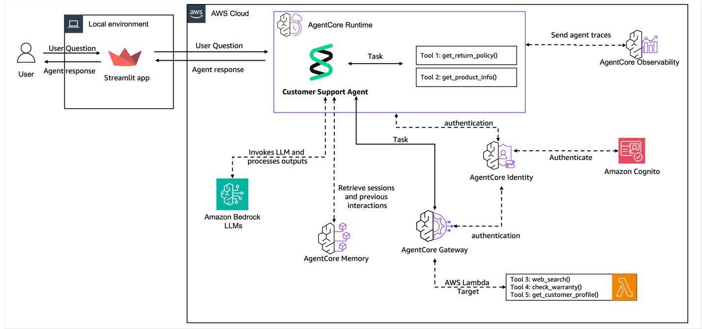
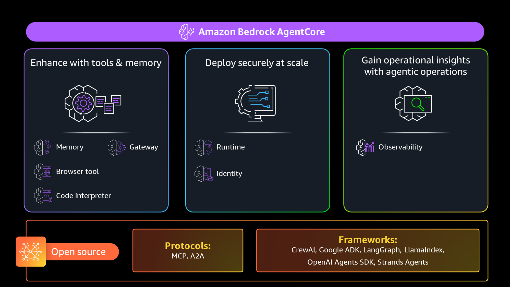
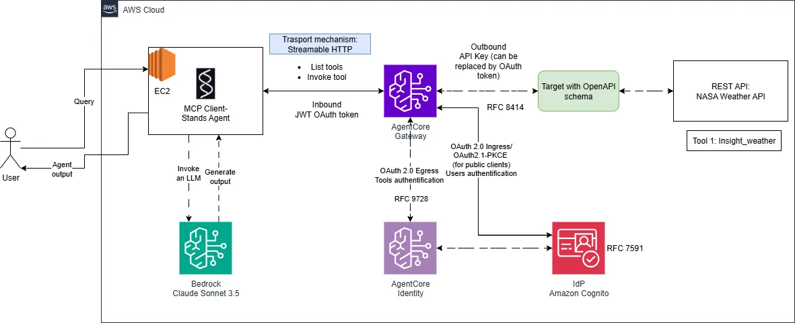

# Agent

AI-powered agent system leveraging AWS infrastructure, Model Context Protocol (MCP), and Claude AI for intelligent task execution with external API integration.

> https://github.com/WaelDataReply/AmazonAgentCore_GW_demo

> https://github.com/aws-samples/sample-agentic-ai-demos/tree/main/modules/anthropic-bedrock-python-ecs-mcp

> https://medium.com/@wael-saideni/building-production-ready-mcp-workflows-with-amazon-bedrock-agentcore-gateway-d8386db65df3

> https://engineering.doit.com/building-aws-architecture-with-mcp-servers-and-strands-agents-e53bd163962f




> https://aws.amazon.com/blogs/machine-learning/move-your-ai-agents-from-proof-of-concept-to-production-with-amazon-bedrock-agentcore/


Although large language models (LLMs) excel at understanding language and generating content, building real-world agentic applications requires complex workflow management, tool calling capabilities, and context management. Multi-agent architectures address these challenges by breaking down complex systems into specialized components, but they introduce new complexities in agent coordination, memory management, and workflow orchestration.

In this post, we show how to deploy gpt-oss-20b model to SageMaker managed endpoints and demonstrate a practical stock analyzer agent assistant example with LangGraph, a powerful graph-based framework that handles state management, coordinated workflows, and persistent memory systems. We will then deploy our agents to Amazon Bedrock AgentCore, a unified orchestration layer that abstracts away infrastructure and allows you to securely deploy and operate AI agents at scale.

Amazon Bedrock AgentCore is a comprehensive suite of services designed to help you build, deploy, and scale agentic AI applications. If you’re new to AgentCore, we recommend exploring our existing deep-dive posts on individual services: AgentCore Runtime for secure agent deployment and scaling, AgentCore Gateway for enterprise tool development, AgentCore Identity for securing agentic AI at scale, AgentCore Memory for building context-aware agents, AgentCore Code Interpreter for code execution, AgentCore Browser Tool for web interaction, and AgentCore Observability for transparency on your agent behavior. This post demonstrates how these services work together in a real-world scenario.

we build a functional prototype that demonstrates the core capabilities needed for customer support. In this case, we use Strands Agents, an open source agent framework, to build the proof of concept and Anthropic’s Claude 3.7 Sonnet on Amazon Bedrock as the large language model (LLM) powering our agent. For your application, you can use another agent framework and model of your choice.

Amazon Bedrock AgentCore Gateway simplifies this process by centralizing tools into reusable, secure endpoints that agents can access. Combined with Amazon Bedrock AgentCore Identity for authentication, it creates an enterprise-grade tool sharing infrastructure.

In this case, we convert our web search tool to be used in the gateway and keep the return policy and get product information tools local to this agent. That is important because web search is a common capability that can be reused across different use cases in an organization, and return policy and production information are capabilities commonly associated with customer support services. With Amazon Bedrock AgentCore services, you can decide which capabilities to use and how to combine them. In this case, we also use two new tools that could have been developed by other teams: check warranty and get customer profile. Because those teams have already exposed those tools using AWS Lambda functions, we can use them as targets to our Amazon Bedrock AgentCore Gateway. Amazon Bedrock AgentCore Gateway can also support REST APIs as target. That means that if we have an OpenAPI specification or a Smithy model, we can also quickly expose our tools using Amazon Bedrock AgentCore Gateway.

Convert existing services to MCP
Amazon Bedrock AgentCore Gateway uses the Model Context Protocol (MCP) to standardize how agents access tools. Converting existing Lambda functions into MCP endpoints requires minimal changes—mainly adding tool schemas and handling the MCP context. To use this functionality, we convert our local tools to Lambda functions and create the tools schema definitions to make these functions discoverable by agents

For demonstration purposes, we build a new Lambda function from scratch. In reality, organizations already have different functionalities available as REST services or Lambda functions, and this approach lets you expose existing enterprise services as agent tools without rebuilding them.

Configure security with Amazon Bedrock AgentCore Gateway and integrate with Amazon Bedrock AgentCore Identity
Amazon Bedrock AgentCore Gateway requires authentication for both inbound and outbound connections. Amazon Bedrock AgentCore Identity handles this through standard OAuth flows. After you set up an OAuth authorization configuration, you can create a new gateway and pass this configuration to it. 

With the tools centralized and secured, our final major hurdle is production deployment. Our agent currently runs locally on your laptop, which is ideal for experimentation but unsuitable for real customers. Production requires scalable infrastructure, comprehensive monitoring, automatic error recovery, and the ability to handle multiple concurrent users reliably.

Amazon Bedrock AgentCore Runtime transforms your local agent into a production-ready service with minimal code changes. Combined with Amazon Bedrock AgentCore Observability, it provides enterprise-grade reliability, automatic scaling, and comprehensive monitoring capabilities that operations teams need to maintain agentic applications in production.

The transformation required minimal code changes at each step, showcasing how Amazon Bedrock AgentCore services work together to solve the operational challenges that typically stall promising proofs of concept. Memory capabilities avoid the “goldfish agent” problem, centralized tool management through Amazon Bedrock AgentCore Gateway creates a reusable infrastructure that securely serves multiple use cases, Amazon Bedrock AgentCore Runtime provides enterprise-grade deployment with automatic scaling, and Amazon Bedrock AgentCore Observability delivers the monitoring capabilities operations teams need to maintain production systems.


> https://aws.amazon.com/blogs/machine-learning/harness-the-power-of-mcp-servers-with-amazon-bedrock-agents/


Today, MCP is providing agents standard access to an expanding list of accessible tools that you can use to accomplish a variety of tasks. In time, MCP can promote better discoverability of agents and tools through marketplaces, enabling agents to share context and have common workspaces for better interaction, and scale agent interoperability across the industry.

Model Context Protocol
Developed by Anthropic as an open protocol, MCP provides a standardized way to connect AI models to virtually any data source or tool. Using a client-server architecture, MCP enables developers to expose their data through lightweight MCP servers while building AI applications as MCP clients that connect to these servers. Through this architecture, MCP enables users to build more powerful, context-aware AI agents that can seamlessly access the information and tools they need. Whether you’re connecting to external systems or internal data stores or tools, you can now use MCP to interface with all of them in the same way. The client-server architecture of MCP enables your agent to access new capabilities as the MCP server updates without requiring any changes to the application code.




> https://aws.amazon.com/blogs/machine-learning/amazon-bedrock-agentcore-is-now-generally-available/


Drawing on our experience building mission-critical systems, Amazon Bedrock AgentCore is a comprehensive agentic platform that enables organizations to get to production with confidence.

AgentCore: Get agents to production fast
AgentCore, now generally available, makes it possible for every developer to get agents from pilots to full-scale production fast. AgentCore gives you the complete foundation you need to build, deploy, and operate agents. You can easily equip agents with tools, memory, and data to handle complex workflows. You can deploy agents with a few lines of code on one of the most secure and scalable runtimes available today. And you can operate those agents with the controls and access management required for enterprise deployments. You can do all of this without any infrastructure management, and it’s easy to get started using any model or agent framework of your choice.


---

## 📋 Table of Contents
- [System Overview](#system-overview)
- [Architecture Components](#architecture-components)
- [Operational Flow](#operational-flow)
- [Security & Authentication](#security--authentication)

---

## System Overview

This solution implements an intelligent AI agent that:
- Processes user requests through a conversational interface
- Makes autonomous decisions to invoke external tools
- Securely integrates with third-party APIs
- Manages authentication across multiple architectural layers



---

## Architecture Components

### User Interface & Application Layer
| Component | Description |
|-----------|-------------|
| **User Interface** | Sends requests and receives responses from the AI agent |
| **EC2 Instance** | Hosts the MCP client application running the Strands-based AI agent |
| **MCP Client-Strands Agent** | Agent implementation using AWS Strands framework (v1.0.1), framework-agnostic |

### AI Processing Layer
| Component | Description |
|-----------|-------------|
| **Amazon Bedrock** | Hosts Claude Sonnet 3.5 model providing language model capabilities |
| **Claude Sonnet 3.5** | Large language model powering intelligent agent responses |

### MCP Infrastructure
| Component | Description |
|-----------|-------------|
| **AgentCore Gateway** | Transforms OpenAPI specifications into MCP-compliant tools |
| **AgentCore Identity** | Manages comprehensive authentication and authorization |

### Security & Identity Management
| Component | Description |
|-----------|-------------|
| **Amazon Cognito** | Handles end-user authentication and token management |
| **OAuth 2.0 Protocols** | Implements secure authentication across architectural layers |

### External Integration
| Component | Description |
|-----------|-------------|
| **Weather API** | External REST API providing Mars weather data |
| **MCP Tool** | Bridges Weather API with agent via MCP specification |

---

## Operational Flow

### 1. User Request Flow
```
User Query
    ↓
EC2 Application (Strands Agent)
    ↓
Agent Evaluates: Tool Needed?
    ↓
[Yes] → Route to AgentCore Gateway
[No]  → Direct LLM Response
```

**Steps:**
1. User sends a query to the application
2. EC2 application receives and processes the request
3. Agent determines if external tool invocation is needed

### 2. Language Model Interaction
```
Agent Request
    ↓
Amazon Bedrock
    ↓
Claude Sonnet 3.5
    ↓
Response or Tool Decision
```

**Steps:**
1. Agent invokes Claude Sonnet 3.5 via Amazon Bedrock
2. Model generates response or determines tool need
3. Response routed back to agent

### 3. Tool Usage via AgentCore Gateway
```
Agent ← JWT Token → AgentCore Gateway
                ↓
          Translate MCP → REST
                ↓
          Weather API
                ↓
        Return Data
```

**Steps:**
1. Agent communicates with AgentCore Gateway via streamable HTTP
2. Agent lists available tools or invokes specific tool
3. Inbound authentication uses JWT OAuth tokens
4. Gateway translates MCP request into REST API call
5. Results returned to agent

---

## Security & Authentication

### Authentication Layers

| Layer | Method | Purpose |
|-------|--------|---------|
| **Inbound (Agent → Gateway)** | JWT OAuth Token | Secures agent-to-gateway communications |
| **Outbound (Gateway → Weather API)** | API Key / OAuth Token | Secures third-party API access |
| **User Authentication** | OAuth 2.0 Ingress (RFC 7591) | Manages end-user access via Cognito |
| **Tool Authentication** | OAuth 2.0 Egress (RFC 9728) | Manages tool-level authorization |

### Key Security Components
- **Amazon Cognito**: User authentication and token management
- **AgentCore Identity**: Tool-level authentication and authorization
- **JWT Tokens**: Secure communication between system components
- **OAuth 2.0 Protocols**: Multi-layer secure authentication

