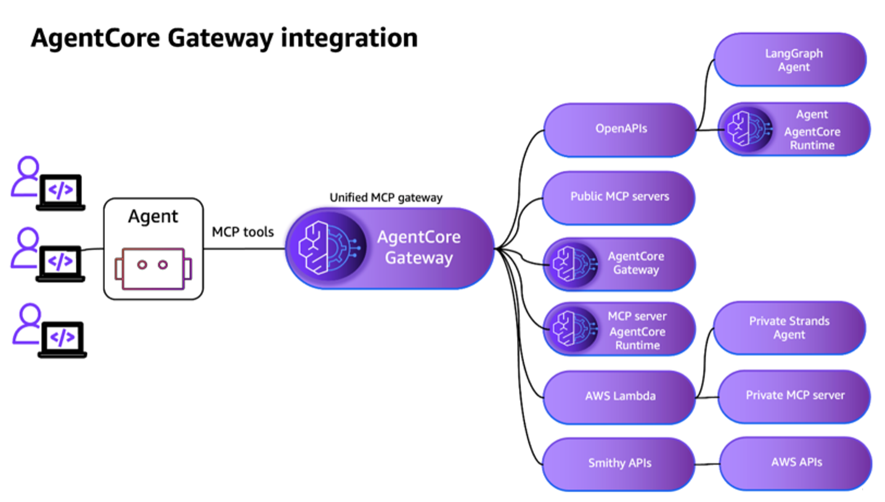
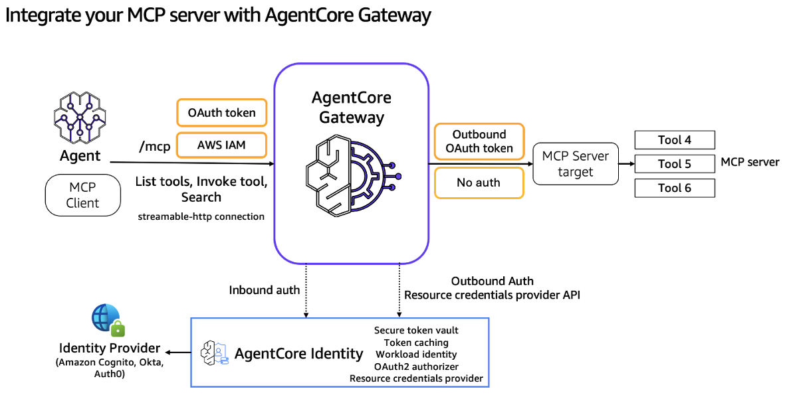

# Agent

AI-powered agent system leveraging AWS infrastructure, Model Context Protocol (MCP), and Claude AI for intelligent task execution with external API integration.

> https://github.com/WaelDataReply/AmazonAgentCore_GW_demo

> https://github.com/aws-samples/sample-agentic-ai-demos/tree/main/modules/anthropic-bedrock-python-ecs-mcp

> https://medium.com/@wael-saideni/building-production-ready-mcp-workflows-with-amazon-bedrock-agentcore-gateway-d8386db65df3

> https://engineering.doit.com/building-aws-architecture-with-mcp-servers-and-strands-agents-e53bd163962f


> https://aws.amazon.com/blogs/machine-learning/move-your-ai-agents-from-proof-of-concept-to-production-with-amazon-bedrock-agentcore/


Although large language models (LLMs) excel at understanding language and generating content, building real-world agentic applications requires complex workflow management, tool calling capabilities, and context management. Multi-agent architectures address these challenges by breaking down complex systems into specialized components, but they introduce new complexities in agent coordination, memory management, and workflow orchestration.

In this post, we show how to deploy gpt-oss-20b model to SageMaker managed endpoints and demonstrate a practical stock analyzer agent assistant example with LangGraph, a powerful graph-based framework that handles state management, coordinated workflows, and persistent memory systems. We will then deploy our agents to Amazon Bedrock AgentCore, a unified orchestration layer that abstracts away infrastructure and allows you to securely deploy and operate AI agents at scale.

Amazon Bedrock AgentCore is a comprehensive suite of services designed to help you build, deploy, and scale agentic AI applications. If you’re new to AgentCore, we recommend exploring our existing deep-dive posts on individual services: AgentCore Runtime for secure agent deployment and scaling, AgentCore Gateway for enterprise tool development, AgentCore Identity for securing agentic AI at scale, AgentCore Memory for building context-aware agents, AgentCore Code Interpreter for code execution, AgentCore Browser Tool for web interaction, and AgentCore Observability for transparency on your agent behavior. This post demonstrates how these services work together in a real-world scenario.

we build a functional prototype that demonstrates the core capabilities needed for customer support. In this case, we use Strands Agents, an open source agent framework, to build the proof of concept and Anthropic’s Claude 3.7 Sonnet on Amazon Bedrock as the large language model (LLM) powering our agent. For your application, you can use another agent framework and model of your choice.

Amazon Bedrock AgentCore Gateway simplifies this process by centralizing tools into reusable, secure endpoints that agents can access. Combined with Amazon Bedrock AgentCore Identity for authentication, it creates an enterprise-grade tool sharing infrastructure.

In this case, we convert our web search tool to be used in the gateway and keep the return policy and get product information tools local to this agent. That is important because web search is a common capability that can be reused across different use cases in an organization, and return policy and production information are capabilities commonly associated with customer support services. With Amazon Bedrock AgentCore services, you can decide which capabilities to use and how to combine them. In this case, we also use two new tools that could have been developed by other teams: check warranty and get customer profile. Because those teams have already exposed those tools using AWS Lambda functions, we can use them as targets to our Amazon Bedrock AgentCore Gateway. Amazon Bedrock AgentCore Gateway can also support REST APIs as target. That means that if we have an OpenAPI specification or a Smithy model, we can also quickly expose our tools using Amazon Bedrock AgentCore Gateway.

Convert existing services to MCP
Amazon Bedrock AgentCore Gateway uses the Model Context Protocol (MCP) to standardize how agents access tools. Converting existing Lambda functions into MCP endpoints requires minimal changes—mainly adding tool schemas and handling the MCP context. To use this functionality, we convert our local tools to Lambda functions and create the tools schema definitions to make these functions discoverable by agents

For demonstration purposes, we build a new Lambda function from scratch. In reality, organizations already have different functionalities available as REST services or Lambda functions, and this approach lets you expose existing enterprise services as agent tools without rebuilding them.

Configure security with Amazon Bedrock AgentCore Gateway and integrate with Amazon Bedrock AgentCore Identity
Amazon Bedrock AgentCore Gateway requires authentication for both inbound and outbound connections. Amazon Bedrock AgentCore Identity handles this through standard OAuth flows. After you set up an OAuth authorization configuration, you can create a new gateway and pass this configuration to it. 

With the tools centralized and secured, our final major hurdle is production deployment. Our agent currently runs locally on your laptop, which is ideal for experimentation but unsuitable for real customers. Production requires scalable infrastructure, comprehensive monitoring, automatic error recovery, and the ability to handle multiple concurrent users reliably.

Amazon Bedrock AgentCore Runtime transforms your local agent into a production-ready service with minimal code changes. Combined with Amazon Bedrock AgentCore Observability, it provides enterprise-grade reliability, automatic scaling, and comprehensive monitoring capabilities that operations teams need to maintain agentic applications in production.

The transformation required minimal code changes at each step, showcasing how Amazon Bedrock AgentCore services work together to solve the operational challenges that typically stall promising proofs of concept. Memory capabilities avoid the “goldfish agent” problem, centralized tool management through Amazon Bedrock AgentCore Gateway creates a reusable infrastructure that securely serves multiple use cases, Amazon Bedrock AgentCore Runtime provides enterprise-grade deployment with automatic scaling, and Amazon Bedrock AgentCore Observability delivers the monitoring capabilities operations teams need to maintain production systems.


> https://aws.amazon.com/blogs/machine-learning/harness-the-power-of-mcp-servers-with-amazon-bedrock-agents/


Today, MCP is providing agents standard access to an expanding list of accessible tools that you can use to accomplish a variety of tasks. In time, MCP can promote better discoverability of agents and tools through marketplaces, enabling agents to share context and have common workspaces for better interaction, and scale agent interoperability across the industry.

Model Context Protocol
Developed by Anthropic as an open protocol, MCP provides a standardized way to connect AI models to virtually any data source or tool. Using a client-server architecture, MCP enables developers to expose their data through lightweight MCP servers while building AI applications as MCP clients that connect to these servers. Through this architecture, MCP enables users to build more powerful, context-aware AI agents that can seamlessly access the information and tools they need. Whether you’re connecting to external systems or internal data stores or tools, you can now use MCP to interface with all of them in the same way. The client-server architecture of MCP enables your agent to access new capabilities as the MCP server updates without requiring any changes to the application code.


> https://aws.amazon.com/blogs/machine-learning/amazon-bedrock-agentcore-is-now-generally-available/


Drawing on our experience building mission-critical systems, Amazon Bedrock AgentCore is a comprehensive agentic platform that enables organizations to get to production with confidence.

AgentCore: Get agents to production fast
AgentCore, now generally available, makes it possible for every developer to get agents from pilots to full-scale production fast. AgentCore gives you the complete foundation you need to build, deploy, and operate agents. You can easily equip agents with tools, memory, and data to handle complex workflows. You can deploy agents with a few lines of code on one of the most secure and scalable runtimes available today. And you can operate those agents with the controls and access management required for enterprise deployments. You can do all of this without any infrastructure management, and it’s easy to get started using any model or agent framework of your choice.

Building agents can be hard – you need to figure out how to integrate with identity providers, how to build memory and observability, and integrate with tools. Our agentic platform offers fully-managed services across the agent development lifecycle from build to deploy to operate. You can mix and match, use any model or framework, offering maximum flexibility with access to enterprise-grade infrastructure and tools. Let’s look at its core capabilities.

Build the way you want: The agent landscape is evolving rapidly, with new frameworks, models, and protocols emerging almost weekly. You can build the way you want with composable AgentCore services that can be used together or independently. Your organization can choose which AgentCore services the team needs while using their preferred frameworks (including CrewAI, Google ADK, LangGraph, LlamaIndex, OpenAI Agents SDK, and Strands Agents) and models (including those available on Amazon Bedrock or models available outside Bedrock including OpenAI and Gemini), so you stay free to build the way you want.

Foundational tools for agent success: Agents create value with concrete actions – writing and executing code, connecting to company systems, and navigating the web. AgentCore provides these essential services: AgentCore Code Interpreter enables agents to generate and execute code securely in isolated environments, and AgentCore Browser allows agents to interact with web applications at scale. Meanwhile, AgentCore Gateway transforms your existing APIs and AWS Lambda functions into agent-compatible tools, connects to existing MCP servers, and provides seamless integration with essential third-party business tools and services (such as Jira, Asana, and Zendesk). This unified access point enables secure integration across your enterprise systems. With AgentCore Identity, agents can securely access and operate across these tools with proper authentication and authorization using OAuth standards.

Context-aware agents with intelligent memory: For agents to be truly effective, they need to maintain context and learn from interactions over time. Consider a sales support agent helping a customer explore enterprise software options – it should remember the customer’s industry, budget constraints, and technical requirements across multiple conversations, eliminating repetitive questions and delivering increasingly personalized recommendations. Similarly, when assisting with complex technical troubleshooting, an agent should recall previous debugging attempts and their outcomes to provide more targeted solutions. AgentCore Memory helps developers create these sophisticated, context-aware experiences without managing complex memory infrastructure, helping agents build and maintain detailed understanding of user preferences, historical interactions, and relevant context that enriches every conversation.

Comprehensive observability for trustworthy agents: Because agents reason in real-time and non-deterministically perform actions, you need complete visibility into the reasoning and actions of agents. Powered by Amazon CloudWatch, AgentCore Observability provides comprehensive monitoring through real-time dashboards and detailed audit trails. Organizations can track every agent action, debug issues quickly, and continuously optimize performance. Through OpenTelemetry (OTEL) compatibility, AgentCore Observability integrates with existing monitoring tools, such as CloudWatch, Dynatrace, Datadog, Arize Phoenix, LangSmith, and Langfuse.

Industry-leading reliability at any scale: Unlike traditional applications, agent workload durations can be inherently unpredictable. AgentCore Runtime is designed for this variability, automatically scaling from zero to thousands of sessions as needed, and it offers an industry-leading runtime of eight hours for long running tasks.


> https://aws.amazon.com/blogs/machine-learning/transform-your-mcp-architecture-unite-mcp-servers-through-agentcore-gateway/


As AI agents are adopted at scale, developer teams can create dozens to hundreds of specialized Model Context Protocol (MCP) servers, tailored for specific agent use case and domain, organization functions or teams. Organizations also need to integrate their own existing MCP servers or open source MCP servers for their AI workflows. There is a need for a way to efficiently combine these existing MCP servers–whether custom-built, publicly available, or open source–into a unified interface that AI agents can readily consume and teams can seamlessly share across the organization.

Earlier this year, we introduced Amazon Bedrock AgentCore Gateway, a fully managed service that serves as a centralized MCP tool server, providing a unified interface where agents can discover, access, and invoke tools. Today, we’re extending support for existing MCP servers as a new target type in AgentCore Gateway. With this capability, you can group multiple task-specific MCP servers aligned to agent goals behind a single, manageable MCP gateway interface. This reduces the operational complexity of maintaining separate gateways, while providing the same centralized tool and authentication management that existed for REST APIs and AWS Lambda functions.

Without a centralized approach, customers face significant challenges: discovering and sharing tools across organizations becomes fragmented, managing authentication across multiple MCP servers grows increasingly complex, and maintaining separate gateway instances for each server quickly becomes unmanageable. Amazon Bedrock AgentCore Gateway helps solves these challenges by treating existing MCP servers as native targets, giving customers a single point of control for routing, authentication, and tool management—making it as simple to integrate MCP servers as it is to add other targets to the gateway.


The following diagram illustrates how an ordering agent interacts with multiple MCP servers through AgentCore Gateway. The agent connects to the gateway and discovers the available tools. Each team maintains control over their domain-specific tools while contributing to a cohesive agent experience. The gateway handles tool naming collisions, authentication, and provides unified semantic search across the tools.

The AgentCore Gateway serves as an integration hub in modern agentic architectures, offering a unified interface for connecting diverse agent implementations with a wide array of tool providers. The architecture, as illustrated in the diagram, demonstrates how the gateway bridges the gap between agent and tool implementation approaches, now enhanced with the ability to directly integrate MCP server targets.

AgentCore Gateway integration architecture
In AgentCore Gateway, a target defines the APIs, Lambda functions, or other MCP servers that a gateway will provide as tools to an agent. Targets can be Lambda functions, OpenAPI specifications, Smithy models, MCP servers, or other tool definitions.

With this authentication foundation you get sophisticated tool management capabilities through a unified architecture. When an agent requests tool discovery, the gateway provides a consistent view across the integrated targets, with tools from MCP servers appearing alongside Lambda functions and traditional APIs. 



The gateway combines MCP servers, traditional APIs, and serverless functions into a coherent tool environment. This capability, along with enterprise-grade security and performance, makes it a beneficial infrastructure for agentic computing.



In this post, we’ll guide you through the steps to set up an MCP server target in AgentCore Gateway, which is as simple as adding a new MCP server type target to a new or existing MCP Gateway. Adding an MCP server to an AgentCore Gateway will allow you to centralize your tool management, security authentication, and operational best practices with managing MCP servers at scale.


> https://aws.amazon.com/blogs/machine-learning/build-multi-agent-site-reliability-engineering-assistants-with-amazon-bedrock-agentcore/

The architecture demonstrates how the SRE support agent integrates seamlessly with Amazon Bedrock AgentCore components:
- Customer interface – Receives alerts about degraded API response times and returns comprehensive agent responses
- Amazon Bedrock AgentCore Runtime – Manages the execution environment for the multi-agent SRE solution
- SRE support agent – Multi-agent collaboration system that processes incidents and orchestrates responses
- Amazon Bedrock AgentCore Gateway – Routes requests to specialized tools through OpenAPI interfaces:
  - Kubernetes API for getting cluster events
  - Logs API for analyzing log patterns
  - Metrics API for analyzing performance trends
  - Runbooks API for searching operational procedures
- Amazon Bedrock AgentCore Memory – Stores and retrieves session context and previous interactions for continuity
- Amazon Bedrock AgentCore Identity – Handles authentication for tool access using Amazon Cognito integration
- Amazon Bedrock AgentCore Observability – Collects and visualizes agent traces for monitoring and debugging
- Amazon Bedrock LLMs – Powers the agent intelligence through Anthropic’s Claude large language models (LLMs)

The multi-agent solution uses a supervisor-agent pattern where a central orchestrator coordinates five specialized agents:
- Supervisor agent – Analyzes incoming queries and creates investigation plans, routing work to appropriate specialists and aggregating results into comprehensive reports
- Kubernetes infrastructure agent – Handles container orchestration and cluster operations, investigating pod failures, deployment issues, resource constraints, and cluster events
- Application logs agent – Processes log data to find relevant information, identifies patterns and anomalies, and correlates events across multiple services
- Performance metrics agent – Monitors system metrics and identifies performance issues, providing real-time analysis and historical trending
- Operational runbooks agent – Provides access to documented procedures, troubleshooting guides, and escalation procedures based on the current situation

The Amazon Bedrock AgentCore Gateway component converts the SRE agent’s backend APIs (Kubernetes, application logs, performance metrics, and operational runbooks) into Model Context Protocol (MCP) tools. This enables agents built with an open-source framework supporting MCP (such as LangGraph in this post) to seamlessly access infrastructure APIs.

Security for the entire solution is provided by Amazon Bedrock AgentCore Identity. It supports ingress authentication for secure access control for agents connecting to the gateway, and egress authentication to manage authentication with backend servers, providing secure API access without hardcoding credentials.

The serverless execution environment for deploying the SRE agent in production is provided by Amazon Bedrock AgentCore Runtime. It automatically scales from zero to handle concurrent incident investigations while maintaining complete session isolation. Amazon Bedrock AgentCore Runtime supports both OAuth and AWS Identity and Access Management (IAM) for agent authentication. Applications that invoke agents must have appropriate IAM permissions and trust policies.

Amazon Bedrock AgentCore Memory transforms the SRE agent from a stateless system into an intelligent learning assistant that personalizes investigations based on user preferences and historical context. The memory component provides three distinct strategies:
- User preferences strategy (/sre/users/{user_id}/preferences) – Stores individual user preferences for investigation style, communication channels, escalation procedures, and report formatting. For example, Alice (a technical SRE) receives detailed systematic analysis with troubleshooting steps, whereas Carol (an executive) receives business-focused summaries with impact analysis.
- Infrastructure knowledge strategy (/sre/infrastructure/{user_id}/{session_id}) – Accumulates domain expertise across investigations, enabling agents to learn from past discoveries. When the Kubernetes agent identifies a memory leak pattern, this knowledge becomes available for future investigations, enabling faster root cause identification.
- Investigation memory strategy (/sre/investigations/{user_id}/{session_id}) – Maintains historical context of past incidents and their resolutions. This enables the solution to suggest proven remediation approaches and avoid anti-patterns that previously failed.

Adding observability to the SRE agent
Adding observability to an SRE agent deployed on Amazon Bedrock AgentCore Runtime is straightforward using the Amazon Bedrock AgentCore Observability primitive. This enables comprehensive monitoring through Amazon CloudWatch with metrics, traces, and logs. 

We start by setting up the repository and establishing the local runtime environment with API keys, LLM providers, and demo infrastructure. We then bring core AgentCore components online by creating the gateway for standardized API access, configuring authentication, and establishing tool connectivity. We add intelligence through AgentCore Memory, creating strategies for user preferences and investigation history while loading personas for personalized incident response. Finally, we configure individual agents with specialized tools, integrate memory capabilities, orchestrate collaborative workflows, and deploy to AgentCore Runtime with full observability.

This investigation demonstrates how Amazon Bedrock AgentCore primitives work together:
- Amazon Bedrock AgentCore Gateway – Provides secure access to infrastructure APIs through MCP tools
- Amazon Bedrock AgentCore Identity – Handles ingress and egress authentication
- Amazon Bedrock AgentCore Runtime – Hosts the multi-agent solution with automatic scaling
- Amazon Bedrock AgentCore Memory – Personalizes Alice’s experience and stores investigation knowledge for future incidents
- Amazon Bedrock AgentCore Observability – Captures detailed metrics and traces in CloudWatch for monitoring and debugging

The SRE agent demonstrates intelligent agent orchestration, with the supervisor routing work to specialists based on the investigation plan. The solution’s memory capabilities make sure each investigation builds organizational knowledge and provides personalized experiences based on user roles and preferences.

This investigation showcases several key capabilities:
- Multi-source correlation – It connects database configuration issues to API performance degradation
- Sequential investigation – Agents work systematically through the investigation plan while providing live updates
- Source attribution – Findings include the specific tool and data source
- Actionable insights – It provides a clear timeline of events and prioritized recovery steps
- Cascading failure detection – It can help show how one failure propagates through the system


---

## 📋 Table of Contents
- [System Overview](#system-overview)
- [Architecture Components](#architecture-components)
- [Operational Flow](#operational-flow)
- [Security & Authentication](#security--authentication)

---

## System Overview

This solution implements an intelligent AI agent that:
- Processes user requests through a conversational interface
- Makes autonomous decisions to invoke external tools
- Securely integrates with third-party APIs
- Manages authentication across multiple architectural layers


---

## Architecture Components

### User Interface & Application Layer
| Component | Description |
|-----------|-------------|
| **User Interface** | Sends requests and receives responses from the AI agent |
| **EC2 Instance** | Hosts the MCP client application running the Strands-based AI agent |
| **MCP Client-Strands Agent** | Agent implementation using AWS Strands framework (v1.0.1), framework-agnostic |

### AI Processing Layer
| Component | Description |
|-----------|-------------|
| **Amazon Bedrock** | Hosts Claude Sonnet 3.5 model providing language model capabilities |
| **Claude Sonnet 3.5** | Large language model powering intelligent agent responses |

### MCP Infrastructure
| Component | Description |
|-----------|-------------|
| **AgentCore Gateway** | Transforms OpenAPI specifications into MCP-compliant tools |
| **AgentCore Identity** | Manages comprehensive authentication and authorization |

### Security & Identity Management
| Component | Description |
|-----------|-------------|
| **Amazon Cognito** | Handles end-user authentication and token management |
| **OAuth 2.0 Protocols** | Implements secure authentication across architectural layers |

### External Integration
| Component | Description |
|-----------|-------------|
| **Weather API** | External REST API providing Mars weather data |
| **MCP Tool** | Bridges Weather API with agent via MCP specification |

---

## Operational Flow

### 1. User Request Flow
```
User Query
    ↓
EC2 Application (Strands Agent)
    ↓
Agent Evaluates: Tool Needed?
    ↓
[Yes] → Route to AgentCore Gateway
[No]  → Direct LLM Response
```

**Steps:**
1. User sends a query to the application
2. EC2 application receives and processes the request
3. Agent determines if external tool invocation is needed

### 2. Language Model Interaction
```
Agent Request
    ↓
Amazon Bedrock
    ↓
Claude Sonnet 3.5
    ↓
Response or Tool Decision
```

**Steps:**
1. Agent invokes Claude Sonnet 3.5 via Amazon Bedrock
2. Model generates response or determines tool need
3. Response routed back to agent

### 3. Tool Usage via AgentCore Gateway
```
Agent ← JWT Token → AgentCore Gateway
                ↓
          Translate MCP → REST
                ↓
          Weather API
                ↓
        Return Data
```

**Steps:**
1. Agent communicates with AgentCore Gateway via streamable HTTP
2. Agent lists available tools or invokes specific tool
3. Inbound authentication uses JWT OAuth tokens
4. Gateway translates MCP request into REST API call
5. Results returned to agent

---

## Security & Authentication

### Authentication Layers

| Layer | Method | Purpose |
|-------|--------|---------|
| **Inbound (Agent → Gateway)** | JWT OAuth Token | Secures agent-to-gateway communications |
| **Outbound (Gateway → Weather API)** | API Key / OAuth Token | Secures third-party API access |
| **User Authentication** | OAuth 2.0 Ingress (RFC 7591) | Manages end-user access via Cognito |
| **Tool Authentication** | OAuth 2.0 Egress (RFC 9728) | Manages tool-level authorization |

### Key Security Components
- **Amazon Cognito**: User authentication and token management
- **AgentCore Identity**: Tool-level authentication and authorization
- **JWT Tokens**: Secure communication between system components
- **OAuth 2.0 Protocols**: Multi-layer secure authentication

